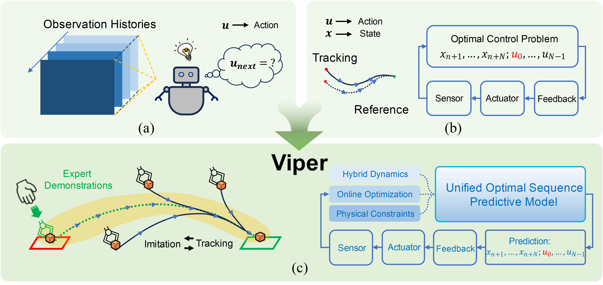

# Viper: Verifiable Imitation Learning Policy for Efficient Robotic Manipulation

    

We introduce **Viper**, a novel visuomotor policy framework that integrates the principles of NMPC with robotic IL. 

## TODO
- [x] Website page.
- [ ] Detailed documentation for codebase.
- [ ] Simulation Benchmark.
- [ ] Training/Inference code and scripts.

