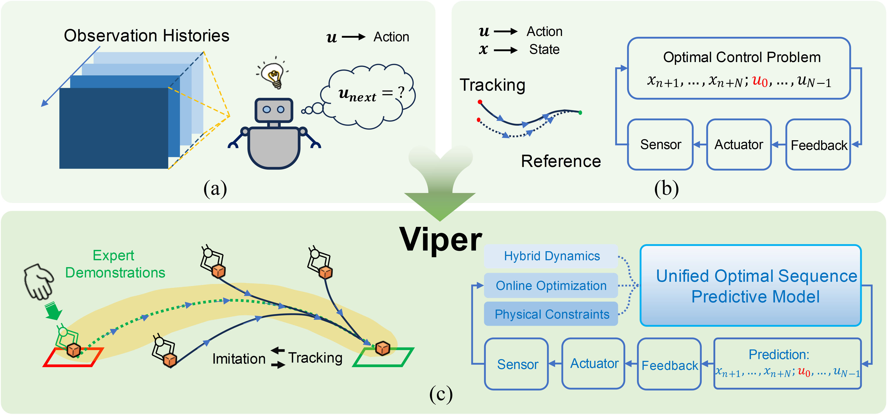

# Viper: Verifiable Imitation Learning Policy for Efficient Robotic Manipulation

<div align="center">

[](https://cheng122.github.io/Viper)
[](./LICENSE)

</div>

<p align="center">
    
<p>

We introduce **Viper**, a novel visuomotor policy framework that integrates the principles of NMPC with robotic IL. 

## TODO
- [x] Website page.
- [ ] Detailed documentation for codebase.
- [ ] Simulation Benchmark.
- [ ] Training/Inference code and scripts.

## 📦 Installation

### Requirements

> Please refer to the [ACT](https://github.com/tonyzhaozh/act) or [lerobot](https://github.com/huggingface/lerobot). Our project can run in the ACT/lerobot environment.

- Python 3.8+
- PyTorch 1.13+
- CUDA 11.0+

### Setup

```bash
# Clone the repository
git clone https://github.com/Cheng122/Viper.git
cd Viper

# Install dependencies: provide our requirements.txt as a reference
pip install -r requirements.txt
```

## 🚀 Quick Start

### 1. Generate Demonstration Data

```bash
python dataset_utils/record_sim_episodes.py \
    --task_name sim_insertion_scripted \
    --dataset_dir <> \
    --num_episodes 200
```

### 2. Train the Policy

```bash
python imitate_episodes.py \
    --task_name sim_insertion_scripted \
    --ckpt_dir <> \
    --num_epochs 2500 \
    --batch_size 16 \
    --horizon_size 50
```

### 3. Evaluate the Policy

```bash
python imitate_episodes.py \
    --task_name sim_insertion_scripted \
    --ckpt_dir <> \
    --horizon_size 50 \
    --eval
```

> Similar to ACT, for real-world data where things can be harder to model, please train for more epochs. 

## 🎯 Simulation Benchmark

Viper enables robots to learn complex bimanual manipulation skills from demonstration data. This project shows four simulation tasks using the ViperX dual-arm robot:

| Task | Description |
|------|-------------|
| **Transfer Cube** | Pick up a cube with right arm and transfer to left arm |
| **Insertion** | Insert a peg into a socket using both arms |
| **Stack Cube** | Stack one cube on top of another |
| **Storage Cube** | Place a cube into a storage box |

## 🙏 Acknowledgments

- This project builds upon the DETR architecture
- Simulation environment based on dm_control
- Inspired by [ACT](https://github.com/tonyzhaozh/act) and related imitation learning works

## 📝 Citation

If you find this work useful, please cite:

```bibtex
@inproceedings{cheng2026viper,
  title={Viper: Verifiable Imitation Learning Policy for Efficient Robotic Manipulation}, 
  author={Cheng, Xianfeng and Gao, Qing and Chen, Guangyu and Xiong, Rui and Hu, Junjie and Guo, Yulan and Zhao, Jieju},
  booktitle={2026 IEEE International Conference on Robotics and Automation (ICRA)},
  pages={x-x},
  year={2026},
  organization={IEEE}}
```
